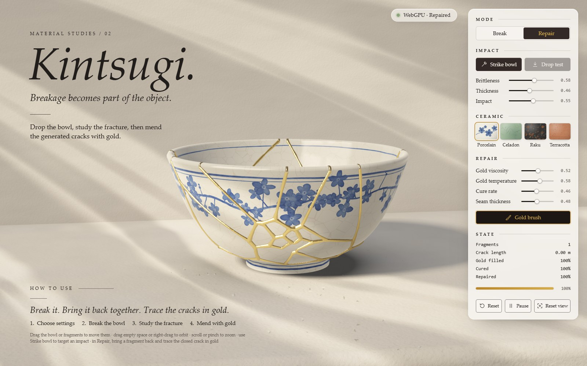
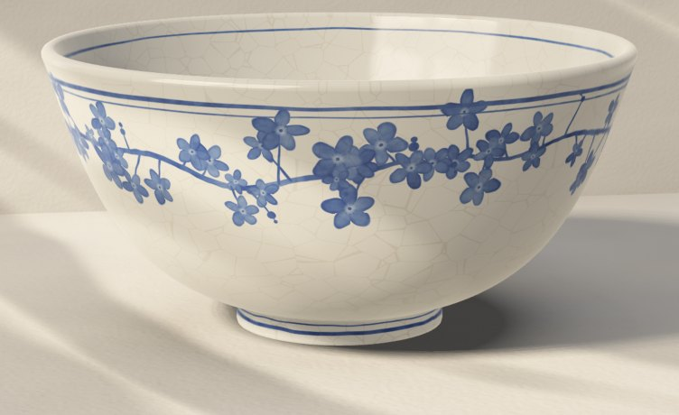
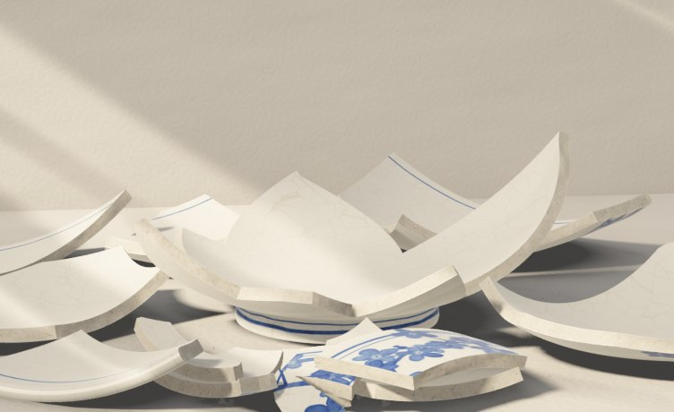
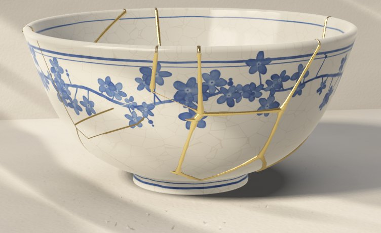
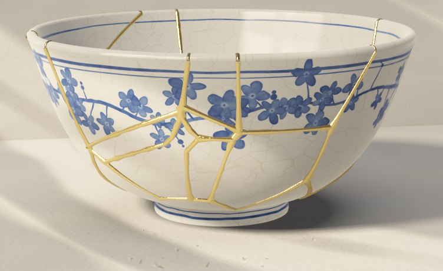

# Kintsugi

<a href="https://tahabakri.github.io/kintsugi-webgpu/">
  
</a>

<p align="center">
  <a href="https://tahabakri.github.io/kintsugi-webgpu/"><b>▶ Open the live demo</b></a>
  &nbsp;·&nbsp; needs a browser with WebGPU (Chrome or Edge)
</p>

Break a porcelain bowl in your browser, then put it back together with gold.

The bowl is not a model with a "broken" version waiting behind it. Where it cracks depends on
where you hit it and how hard. Each piece is a real solid you can pick up, and the gold only runs
along the cracks that break actually made.

This is the second of my Material Studies. No 3D engine, no textures, no model files: the bowl,
the glaze, the light and the gold are all code.

## Try it

1. Click **Strike bowl**, then click the bowl. A steel ball is thrown at that spot.
2. Switch to **Repair**. Pick up a piece and bring it near where it came from. It settles in.
3. Drag the **gold brush** along the closed crack. A few seconds later the gold sets and the piece is bonded.

Do that for every piece and you get the bowl back, with the break drawn on it in gold.

| | |
| --- | --- |
|  |  |
| **Whole.** Crazed glaze and cobalt brushwork, painted by a shader. | **Struck.** The pieces fall where the physics puts them. |
|  |  |
| **Mending.** Gold is laid crack by crack. | **Mended.** Same pieces, same cracks, now gold. |

Hit it somewhere else, or change Brittleness and Impact, and it breaks differently. **Reset**
gives you a new bowl. There are four glazes to try.

## Controls

| | |
| --- | --- |
| Drag a piece | pick it up (throw it, drop it, or fit it back) |
| Drag empty space, or right-drag | orbit |
| Wheel or pinch | zoom |
| Wheel while holding a piece | push it away or pull it closer |
| Shift-drag while holding a piece | turn it |
| `B` `R` | Break mode, Repair mode |
| `S` `G` | Strike bowl, gold brush |
| `Space` `0` `Esc` | pause, reset view, let go |

If a piece falls off the table, a **Recover pieces** button shows up in Repair mode.

## What is going on underneath

<details>
<summary><b>The break</b></summary>

The bowl's surface is treated as a flat sheet (around the bowl, and from foot to rim). When
something hits it hard enough, seed points are scattered on that sheet, dense near the impact
and sparse far away, and a power diagram splits the sheet into cells. A light blow knocks a hole
out. A hard one breaks the wall all the way round and leaves the foot standing.

Each cell is then given thickness and closed up into a watertight mesh, handed to
[Rapier](https://rapier.rs) as a rigid body, and let go. Same seed and same hit, same pieces.
</details>

<details>
<summary><b>The gold</b></summary>

Every crack between two pieces is kept as a line with samples along it. The brush puts resin on
those samples. From there it is a small simulation: resin flows from full samples to empty ones,
cools, and cures. When a crack is closed, full enough and cured enough, the two pieces are
welded into one body. Nothing bonds without gold, and gold on pieces that are apart does nothing.
</details>

<details>
<summary><b>The picture</b></summary>

Plain WebGPU and WGSL. Soft window light through blinds, shadows that sharpen where things touch,
ambient occlusion from a height map of the table, HDR with 4× MSAA, a little bloom and a filmic
curve. The cobalt blossoms, the crazing in the glaze and the grain of the gold are all computed
per pixel.
</details>

<details>
<summary><b>Putting pieces back</b></summary>

A mouse can move a piece across the screen but cannot say how deep it should be or which way
round. So in Repair mode a piece you are holding gets help once it is close to its place: it
turns to face the right way, and over the last few centimetres it is drawn in. Let go too far
away and it just falls. Nothing moves that you are not holding.
</details>

The long version, with the numbers, is in [docs/NOTES.md](docs/NOTES.md).

## Run it yourself

Needs Node 22.12 or newer.

```bash
npm install
npm run dev
```

Open `http://localhost:5173`. To build the static site: `npm run build`.

```bash
npm run typecheck
npm test            # 39 unit tests: fracture, repair, recovery
npm run test:e2e    # 18 browser tests, most need a real WebGPU adapter
```

Stack: TypeScript, Vite, WebGPU, WGSL, Rapier, Vitest, Playwright. No Three.js, no UI framework.

```text
src/
  ceramic/      bowl profile and its surface
  fracture/     impact, seeds, power diagram, shard meshes, colliders, crack graph
  physics/      Rapier world, shard bodies, grab, striker
  repair/       resin flow, curing, alignment, bonding, seam geometry
  gpu/          WebGPU context, pipelines, renderer, camera
  shaders/      WGSL
  interaction/  pointer, picking, orbit, recovery
  ui/           panel, hints, bottom sheet
tests/          unit tests and the Playwright suite
```

## Honest limits

- It needs WebGPU. Without it you get a short note, not a fallback renderer.
- I built and tested it on one laptop with an integrated Intel GPU, in Chrome. On that machine
  it runs at a reduced internal resolution to keep the frame rate up. Other browsers, phones and
  faster GPUs should work but I have not tried them.
- The cracks are a pattern on the surface pushed straight through the wall. There is no stress
  simulation, and a bowl only breaks once.
- Fitting pieces is assisted, on purpose. Doing it with a mouse and no help is not fun.
- The camera stays in front of the wall. To reach the back of the bowl, look down into it.

More of these in [the notes](docs/NOTES.md#limitations).

## License

MIT. See [LICENSE](LICENSE).
